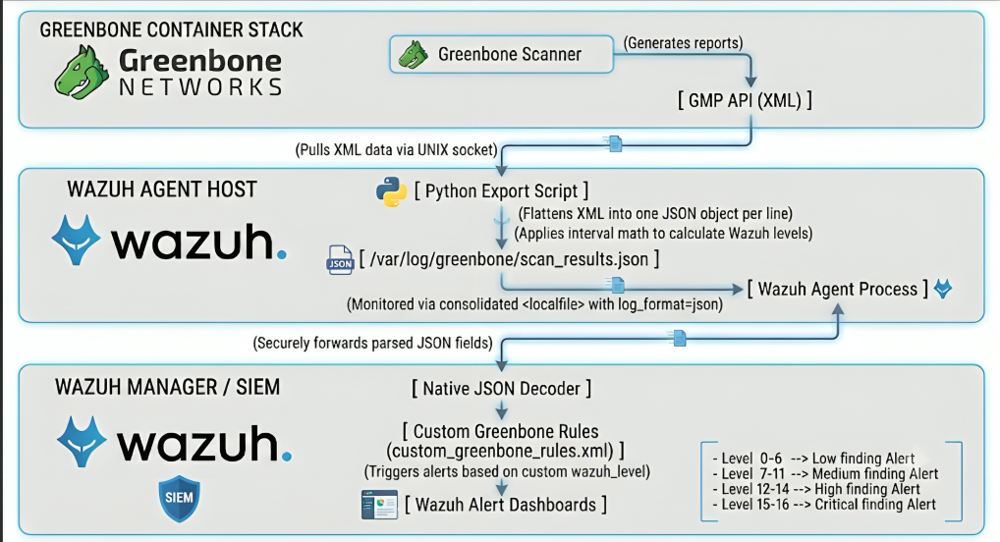
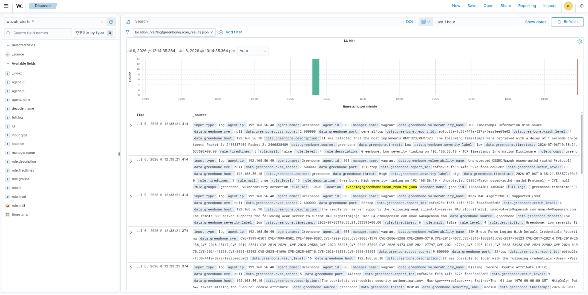

# Greenbone - Wazuh Vulnerability Integration

Ingests Greenbone (OpenVAS) vulnerability scan results into Wazuh as alerts.

## Summary

Greenbone runs active vulnerability scans and produces reports via its GMP API (XML). It has no native Wazuh integration and no JSON export, so a script pulls completed reports over GMP, converts each finding to a JSON line, and drops it into a log file. A Wazuh `<localfile>` ingests that JSON, and custom rules map each finding's CVSS score to a Wazuh alert level:

| CVSS | severity_label | Wazuh level |
|---|---|---|
| 0.0–3.9 | `low` | 4 |
| 4.0–6.9 | `medium` | 9 |
| 7.0–8.9 | `high` | 13 |
| 9.0–10.0 | `critical` | 15 |

```
Greenbone (GMP/XML) → export script → JSON log → Wazuh localfile → custom rules → Wazuh alert
```

Informational/Log-level Greenbone findings (open ports, banner grabs, etc.) are filtered out before reaching Wazuh — only real vulnerabilities become alerts. This complements, not replaces, Wazuh's own Vulnerability Detection module: Wazuh's built-in module correlates agent package inventories against a CVE feed (passive); Greenbone actively scans the network (open ports, weak creds, misconfigs) — different detection surface, same alert pipeline once ingested.



---

## 1. Deploy Greenbone
For the deployment of Greenbone we will make use of the official docker deployment documentation -> https://greenbone.github.io/docs/latest/22.4/container/index.html

Once Greenbone has been installed and it's running in your environment, follow these steps in order to integrate it with Wazuh.

## 2. Expose the GMP socket to the host

Docker-based Greenbone shares GMP over a Unix socket via a named volume by default — not reachable from the host. Expose it:

```bash
mkdir -p /tmp/gvm/gvmd
chmod -R 777 /tmp/gvm
```

Edit `compose.yaml`, and in **both** the `gvmd` and `gsad` services, change:
```diff
  volumes:
-   - gvmd_socket_vol:/run/gvmd
+   - /tmp/gvm/gvmd:/run/gvmd
```

Apply the change (a plain `restart` won't pick up a new volume mapping — you need to recreate):
```bash
docker compose -f compose.yaml up -d --force-recreate gvmd gsad
```

Verify the socket exists:
```bash
ls -la /tmp/gvm/gvmd/
```
You should see `gvmd.sock` listed.

Restart Nginx in order to be able to access the UI:
```bash
docker compose -f compose.yaml restart nginx
```

## 3. Install gvm-tools on the host

```bash
pip3 install gvm-tools python-gvm
echo 'export PATH="$HOME/.local/bin:$PATH"' >> ~/.bashrc
source ~/.bashrc
```

Verify connectivity:
```bash
gvm-cli --gmp-username admin socket --socketpath /tmp/gvm/gvmd/gvmd.sock --pretty --xml "<get_version/>"
```

## 4. Create a Target and Task, run a scan

In Greenbone UI:
- **Configuration → Targets → New Target** — enter the host(s) to scan
- **Scans → Tasks → New Task** — pick the target, Scan Config `Full and fast`
- Start it and wait for `Done`

## 5. Set up the export script

Create `/opt/scripts/greenbone_to_wazuh.py`. 
Change the following config block accordingly:

```python
CONNECTION_MODE = "socket"
GVM_SOCKET_PATH = "/tmp/gvm/gvmd/gvmd.sock"
GVM_HOST = "127.0.0.1"                          #Greenbone IP
GVM_PORT = 9390                 
GVM_USER = "admin"                              #Admin User Greenbone
GVM_PASS = "admin_password"                     #Admin Password Greenbone
STATE_FILE = "/var/lib/greenbone-wazuh/last_report.state"
OUTPUT_LOG = "/var/log/greenbone/scan_results.json"
```

Prepare directories and permissions:
```bash
sudo mkdir -p /var/log/greenbone /var/lib/greenbone-wazuh
sudo chown -R $USER:$USER /var/log/greenbone /var/lib/greenbone-wazuh
sudo chmod 755 /var/log/greenbone
```

Run it:
```bash
python3 /opt/scripts/greenbone_to_wazuh.py
```

Expect output like `Wrote N results, latest report_id=...`. 
Verify:
```bash
cat /var/log/greenbone/scan_results.json
sudo chmod 660 /var/log/greenbone/scan_results.json
sudo chown $USER:wazuh /var/log/greenbone/scan_results.json
```

## 6. Automate the export

With a cronjob you can automate the script so it runs every 5 minutes for example:
```bash
crontab -e
```
```cron
*/5 * * * * /usr/bin/python3 /opt/scripts/greenbone_to_wazuh.py >> /var/log/greenbone_to_wazuh.log 2>&1
```
It is also recommended to empty the file daily to avoid it getting too big.

```cron
0 0 * * * > /var/log/greenbone/scan_results.json
``` 

## 7. Configure Wazuh to ingest the JSON
On your Greenbone environment install the Wazuh Agent and add the following configuration in `/var/ossec/etc/ossec.conf`:

```xml
<localfile>
  <log_format>json</log_format>
  <location>/var/log/greenbone/scan_results.json</location>
</localfile>
```
Restart the agent:
```bash
sudo systemctl restart wazuh-agent
```

## 8. Add custom rules on the Wazuh Manager

`/var/ossec/etc/rules/custom_greenbone_rules.xml`:
```xml
<group name="greenbone,vulnerability-detection,">

  <!-- Base rule: matches any Greenbone JSON record, level 0 so it never alerts on its own -->
  <rule id="110500" level="0">
    <decoded_as>json</decoded_as>
    <field name="greenbone.source">greenbone</field>
    <description>Greenbone vulnerability scan result</description>
  </rule>

  <!-- Low: CVSS 0.0-3.9 -->
  <rule id="110501" level="4">
    <if_sid>110500</if_sid>
    <field name="greenbone.severity_label">low</field>
    <description>Greenbone: Low severity finding on $(greenbone.host) - $(greenbone.vulnerability_name)</description>
  </rule>

  <!-- Medium: CVSS 4.0-6.9 -->
  <rule id="110502" level="9">
    <if_sid>110500</if_sid>
    <field name="greenbone.severity_label">medium</field>
    <description>Greenbone: Medium severity finding on $(greenbone.host) - $(greenbone.vulnerability_name)</description>
  </rule>

  <!-- High: CVSS 7.0-8.9 -->
  <rule id="110503" level="13">
    <if_sid>110500</if_sid>
    <field name="greenbone.severity_label">high</field>
    <description>Greenbone: High severity finding on $(greenbone.host) - $(greenbone.vulnerability_name) - CVE: $(greenbone.cve)</description>
  </rule>

  <!-- Critical: CVSS 9.0-10.0 -->
  <rule id="110504" level="15">
    <if_sid>110500</if_sid>
    <field name="greenbone.severity_label">critical</field>
    <description>Greenbone: CRITICAL finding on $(greenbone.host) - $(greenbone.vulnerability_name) - CVE: $(greenbone.cve)</description>
  </rule>

</group>
```

Restart the manager:
```bash
sudo systemctl restart wazuh-manager
```

## 9. Results


## Common pitfalls to remember

- **Never restart `gvmd` and `gsad` together** — race condition causes `Connection refused` on the socket. Restart `gvmd` alone, wait for `gvmd is ready to accept GMP connections` in its logs, then restart `gsad`.
- **After restarting `gsad` individually, also restart `nginx`** — nginx caches the resolved container IP at its own startup and won't pick up a new one otherwise, causing `502`/"Response error" on login even when `gvmd`/`gsad` are healthy.
- **A volume mapping change in `compose.yaml` needs `--force-recreate`**, not just `restart`, to take effect.
- **Ownership isn't automatic in GVM** — a Task created by `admin` isn't visible to any other user by default, regardless of role. Use global Permissions instead of per-task Observers to avoid repeating this for every new task.
- **`get_report` without an explicit filter defaults to `rows=10`** — always pass `filter_string="... rows=-1"` when pulling full report details, or results beyond the first page (sorted by name) get silently dropped.
- **Greenbone reports `cvss_score=0.0` (not `null`) for Log/Debug findings** — filter on both `cvss is None` and `cvss == 0.0` to correctly exclude informational noise.
- **Match Python environments**: if you `pip3 install --break-system-packages` as a regular user, running the script with `sudo` afterward will fail with `ModuleNotFoundError` — either install as root too, or don't use sudo for the script.