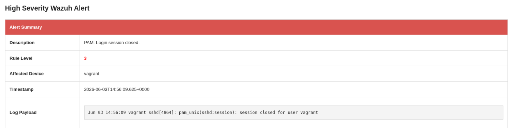

# Custom HTML Email Integration for Wazuh
This custom integration allows Wazuh to send beautifully formatted HTML emails for alerts that match a specific severity level. It extracts key details from the alert JSON payload (like rule description, alert level, affected device, and full logs) and compiles them into a clean, easy-to-read table.

## Features
- **Rich HTML Formatting:** Replaces messy plain-text alerts with a structured HTML table.
- **Dynamically Populated:** Dynamically grabs the rule level, description, affected agent, timestamp, and log payload.
- **Error Logging:** If an email fails to send, errors are gracefully appended to `/var/ossec/logs/integrations.log`

## Setup & Installation Guide
### 1. Prerequisites
Ensure that Python 3 is installed on your Wazuh Manager node. You can verify this by running:

```bash
python3 --version
```

### 2. Deploy the Script

Save the `custom-html-email.py` script to your Wazuh Manager at the following path:
```bash
/var/ossec/integrations/custom-html-email.py
```

Open the script and configure your SMTP server settings at the top of the file:
```python
# --- SMTP CONFIGURATION ---
SMTP_SERVER = "YOUR_SMTP_SERVER_IP_OR_DOMAIN"
SMTP_PORT = 25
SMTP_USER = "sender@yourdomain.com"
SMTP_PASS = "YOUR_PASSWORD" # Optional if your relay doesn't require auth
TO_EMAIL = "recipient@yourdomain.com"
# --------------------------
``` 
If your mail server requires a secure connection (TLS) and authentication, uncomment lines 2 and 3:
```python
try:
    server = smtplib.SMTP(SMTP_SERVER, SMTP_PORT)
    # server.starttls()                  # UNCOMMENT IF YOUR SERVER REQUIRES TLS
    # server.login(SMTP_USER, SMTP_PASS) # UNCOMMENT IF YOUR SERVER REQUIRES AUTH
    server.sendmail(SMTP_USER, TO_EMAIL, msg.as_string())
    server.quit()
``` 
### 3. Set Correct Permissions
Wazuh requires strict ownership and permissions to execute custom integration scripts. Run the following commands:

```bash
chmod 750 /var/ossec/integrations/custom-html-email.py
chown root:wazuh /var/ossec/integrations/custom-html-email.py
```

### 4. Configure Wazuh Manager
Add the integration block to your Wazuh Manager configuration file located at `/var/ossec/etc/ossec.conf`.

Insert the following `<integration>` block inside the `<ossec_config>` tags:
```xml
<ossec_config>
    ...
  <integration>
    <name>custom-html-email.py</name>
    <level>10</level> 
    <alert_format>json</alert_format>
  </integration>
    ...
  </ossec_config>
```
**Note**: The `<level>10</level>` tag means this script will trigger for any alert of Level 10 or higher. You can adjust this value to fit your organization's alerting thresholds (e.g., set to 3 for testing or lower-priority alerts).

- `<rule_id>` tag can also be used to specify certain rules to be sent via email.

### 5. Restart Wazuh Manager
To apply the changes, restart the Wazuh Manager service:
```bash
systemctl restart wazuh-manager
```

### 6. Email Preview


### 7. Troubleshoting
If you are not receiving emails, check the integration log file for SMTP errors:

```bash
tail -f /var/ossec/logs/integrations.log
```

You can also check if you have connection from the Wazuh Manager to the SMTP server with the following command:

``` 
nc -zv <SMPT_DOMAIN_OR_IP> 25
```