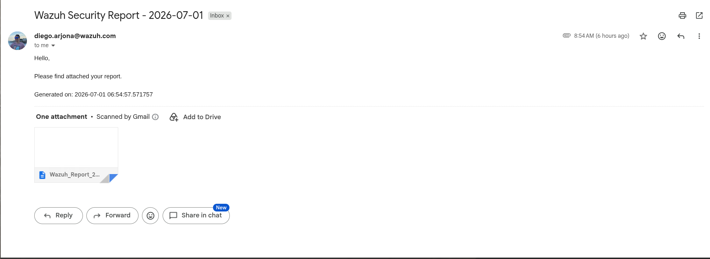

# Automated Daily Wazuh Alerts Report (JSON to Dynamic CSV)

This script automates the extraction of security alerts from the **Wazuh Indexer** using the OpenSearch Scroll API. It flattens nested JSON log structures into a dynamic, clean CSV format, sorts events chronologically (oldest to newest), and falls back to a hyphen (`-`) for missing or non-existent fields. Finally, it sends the report as an email attachment on a scheduled daily basis.

---

## Key Features

* **Unlimited Record Fetching:** Utilizes the OpenSearch Scroll API to pull *all* alerts matching the timeframe, bypasses the standard indexer max limit of 10,000 documents.
* **Dynamic Column Mapping:** Automatically detects and appends any newly introduced or custom fields inside your logs without requiring code changes.
* **Sanitized Layout:** Gracefully replaces missing fields with a placeholder (`-`) and cleans up carriage returns or commas to prevent formatting corruptions inside Excel/CSV readers.
* **Natural Chronological Order:** Arranges data flows from the oldest event (top) to the newest event (bottom).
* **Fault-Resilient:** If your SMTP network relay drops or fails, the script safely saves a local backup copy of the generated CSV file directly on the host server.

---

## Prerequisites

The host machine running this script (e.g., your Wazuh Manager or a dedicated deployment node) must fulfill the following criteria:

1.  **Python 3.9 or higher** installed.
2.  **Network accessibility** to:
    * The Wazuh Indexer cluster endpoint on port `9200`.
    * Your corporate or public SMTP server relay port (e.g., `25`, `587`, etc.).
3.  The Python **`requests`** library.

---

## Step-by-Step Installation Guide

### Step 1: Save the Script
Drop your script content and name it `export_report.py` inside your home working environment directory (e.g., `/home/user/export_report.py`).

### Step 2: Install Python Dependencies
Depending on your OS distribution constraints (such as PEP 668 on modern Linux platforms), choose one of the methods below to safely acquire the `requests` module:

* **Option A: Via System Package Manager (Recommended)**
    ```bash
    sudo apt update
    sudo apt install python3-requests -y
    ```
* **Option B: Force Globally Using Pip**
    ```bash
    pip install requests --break-system-packages
    ```

---

## Advanced Filtering (`filters.txt`)

The script looks for an optional plain-text file named `filters.txt` in the same directory as the script. You can map fields using the same syntax and operators found in the Wazuh Discover dashboard.

Create the file `/home/user/filters.txt` and populate it using any of these **6 supported operators**:

```text
is:
is_not:
is_one_of:
is_not_one_of:
exists:
does_not_exist:
```

**Example:**
```text
is:agent.id=001
is_not:rule.id=500
is_one_of:rule.level=10,11,12
is_not_one_of:data.example=ubuntu,windows
exists:data.srcip
does_not_exist:data.dstip
```
---
## Script Configuration

Open `export_report.py` in your preferred terminal text editor (e.g., `nano export_report.py`) and modify the variables inside the **`=== CONFIGURATION ===`** section to reflect your target environment:

```python
# === CONFIGURATION ===
INDEXER_HOST = "https://YOUR_INDEXER_IP:9200"
INDEXER_USER = "admin"                    # Your default indexer admin user
INDEXER_PASSWORD = "YOUR_INDEXER_PASSWORD"

SMTP_SERVER = "YOUR_SMTP_SERVER_IP/DOMAIN"       # SMTP relay host or external server URL
SMTP_PORT = 25                            # SMTP Port (e.g., 25, 587, 465)
SMTP_USER = "SENDER_ADDRESS"              # Sender address
SMTP_PASSWORD = "your-smtp-password"      # Account/App Password if required
EMAIL_TO = "RECIPIENT_ADDRESS"        # Recipient address
# =====================
``` 
***NOTE***: If you are interfacing with a local unauthenticated internal network mail relay system on port 25 without TLS requirements, ensure that the lines `server.starttls()` and `server.login()` remain commented out within the `send_email()` function block.

---
## Testing Execution Manually

Run a manual iteration of the script to verify valid connectivity parameters against your Wazuh Indexer index mappings:

```bash
python3 /home/user/export_report.py
```

Expected standard stdout output trace:

- Query validation and log payload count confirmation: `[+] Successfully retrieved all X alerts.`

- Local disk serialization fallback step: `[+] Saved backup copy locally to: /home/user/Wazuh_Report_YYYY-MM-DD.csv`

- Mailing dispatch confirmation notice: `[+] Report emailed successfully!`

---

## Scheduling Automation (Crontab)

To schedule this task to trigger automatically every single day at 00:00 (Midnight), use the native Linux system daemon scheduler (cron).

1. Open your current environment execution user crontab editor (using root context or standard script execution owner context):

```
crontab -e
```
2. Paste the following configuration logic sequence at the bottom line of the file:
```
0 0 * * * /usr/bin/python3 /home/user/export_report.py > /var/log/wazuh_report_cron.log 2>&1
```

3. Save changes.

---

## Example
You will receive emails like so:
