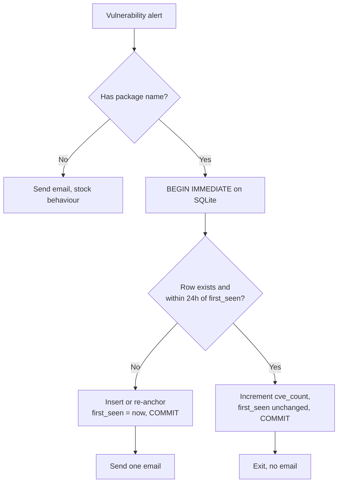

# Vulnerability Email De-duplication - Wazuh Integration

## Table of Contents

* [Introduction](#introduction)
* [Prerequisites](#prerequisites)
* [How It Works](#how-it-works)
* [Installation and Configuration](#installation-and-configuration)
    * [Using the Integration Files](#using-the-integration-files)
    * [Script Configuration](#script-configuration)
    * [Integrator Configuration](#integrator-configuration)
    * [Scheduled Maintenance](#scheduled-maintenance)
* [Integration Steps](#integration-steps)
* [Integration Testing](#integration-testing)
* [Troubleshooting](#troubleshooting)
* [Provenance and Maintenance](#provenance-and-maintenance)
* [Sources](#sources)

---

### Introduction

The Wazuh Vulnerability Detection module emits one alert per (package, CVE) pair.
A single package frequently carries dozens of CVEs, so one scan produces a burst
of near-identical alerts for the same package on the same agent, often hundreds
or thousands at once. Routed to email through the stock integration, that burst
becomes hundreds of near-identical messages.

This integration is a drop-in replacement for a `custom-email` script that
collapses the burst:

- The first alert for a given agent, package and status sends one email and
  opens a 24 hour window.
- Every subsequent CVE for that same agent and package inside the window is
  counted, but no email is sent.
- The window is measured from that first alert and never slides. More alerts
  arriving inside it do not extend it and do not start a new one.
- Once 24 hours have passed since the first alert, the next detection emails
  again and opens a fresh window, so a package that stays vulnerable stays
  visible without becoming noise.
- Non-vulnerability alerts are passed through and emailed unchanged, so the
  script can also serve as the general email path.

How much noise this removes depends on how densely CVEs cluster per package. In
a synthetic load test, 2,000 vulnerability alerts spread across 300 distinct
`(agent, package, status)` combinations, fed through the script at 64-way
concurrency, produced exactly 300 emails: an 85% reduction, one notification per
affected package rather than one per CVE. The sum of the recorded per-row CVE
counts equalled the 2,000 alerts fed in, confirming no updates were lost to the
concurrent writers.

---

### Prerequisites

- Wazuh manager with the Vulnerability Detection module enabled.
- Vulnerability alerts using the Wazuh 4.8+ schema, that is
  `data.vulnerability.cve`, `data.vulnerability.package.name`,
  `data.vulnerability.package.version` and `data.vulnerability.status`.
- Python 3.6 or later. The script uses only the standard library (`sqlite3`,
  `smtplib`, `json`), so no `pip install` step is required. The Wazuh embedded
  interpreter at `/var/ossec/framework/python/bin/python3` satisfies this.
- A reachable SMTP relay. The defaults assume a local MTA on `127.0.0.1:25`.
- Write access to the directory holding the de-duplication database. The default
  is `/var/ossec/logs/`, which is already writable by the `wazuh` user.

---

### How It Works

Each `(agent_id, package_name, status)` gets one row, anchored at `first_seen`:
the moment its first alert arrived. Every alert resolves to one of three cases,
decided entirely at read time:

| State of the row | Decision |
| --- | --- |
| No row exists | Send one email, create the row anchored at now. |
| `now - first_seen >= 24h` | The window has elapsed. Send one email, re-anchor `first_seen` at now. |
| Inside the window | Suppress. Increment the counter and **leave `first_seen` untouched**. |

That last line is the whole de-duplication rule. Because a suppressed alert
never moves the anchor, no volume of alerts can push the window forward, which
is the failure mode of a last-seen window: a package detected every few hours
would slide its own window indefinitely and never notify again.

The package **version** is shown in the email body (read from the triggering
alert, not persisted) but is deliberately kept out of the key, so a version bump
that is still vulnerable does not re-notify. Move it into the key if you want
per-version notifications.

`wazuh-integratord` runs an integration script **once per alert, as a separate
OS process**. A burst of 1,000 alerts is therefore 1,000 short-lived processes,
not one process handling 1,000 items. Three properties make that safe and cheap:

- **Cheap lookup.** Per alert the script does one indexed SQLite lookup and one
  small write. Suppressed alerts exit in under a millisecond, without ever
  opening an SMTP connection. Only the notifying alert pays for sending mail.
- **Safe concurrency.** The store runs in WAL mode with a busy timeout, and the
  check-and-write happens inside a single `BEGIN IMMEDIATE` transaction.
  Concurrent processes for the same package serialize on the write lock and
  exactly one wins at each window boundary, so a burst produces no
  `database is locked` errors, no lost updates, and no duplicate emails.
- **Nothing runs between alerts.** No daemon, no polling, no in-memory state.
  The table holds one row per currently active package and agent, so it stays in
  the kilobytes.

If the database cannot be opened or the de-duplication check raises, the script
**fails open** and sends the email. Losing a notification is worse than sending
a duplicate.



---

### Installation and Configuration

#### Using the Integration Files

This integration ships two files:

| File | Purpose |
| --- | --- |
| `custom-email.py` | The integration logic. |
| `custom-email` | Standard Wazuh shell wrapper that invokes the script with the embedded Python interpreter. |

Copy both to the manager:

```bash
cp custom-email custom-email.py /var/ossec/integrations/
```

Apply the ownership and permissions Wazuh requires. These are not optional:
`wazuh-integratord` refuses to execute an integration file that is
group- or world-writable, and logs `has write permissions` instead of running.

```bash
chmod 750 /var/ossec/integrations/custom-email*
chown root:wazuh /var/ossec/integrations/custom-email*
```

#### Script Configuration

Edit the configuration block at the top of `custom-email.py`. Every value also
accepts an environment variable override, so mail and storage can be redirected
into a sandbox for testing without editing the deployed file.

| Setting | Environment variable | Default | Description |
| --- | --- | --- | --- |
| `SMTP_SERVER` | `VULN_SMTP_HOST` | `127.0.0.1` | SMTP relay host. |
| `SMTP_PORT` | `VULN_SMTP_PORT` | `25` | SMTP relay port. |
| `SENDER_EMAIL` | `VULN_SENDER` | `wazuh@example.com` | From address. |
| `RECEIVER_EMAIL` | `VULN_RECEIVER` | `soc@example.com` | Destination address. |
| `DB_PATH` | `VULN_DEDUP_DB` | `/var/ossec/logs/vuln_dedup.db` | De-duplication store. |
| `LOG_PATH` | `VULN_DEDUP_LOG` | `/var/ossec/logs/custom-email_integration.log` | Script log file. |
| `DEDUP_TTL_SECONDS` | `VULN_DEDUP_TTL` | `86400` (24h) | Window per agent, package and status, measured from the first alert. |

`DEDUP_TTL_SECONDS` is the only behavioural knob. Set it to `43200` for a 12
hour window or `172800` for 48 hours; nothing else in the script needs changing,
and the prune job picks up the new value automatically.

The script does not perform SMTP authentication or STARTTLS. If your relay
requires either, extend `send_email()` with `server.starttls()` and
`server.login()`.

#### Integrator Configuration

Add the integration block to `/var/ossec/etc/ossec.conf` on the manager, inside
`<ossec_config>`:

```xml
<ossec_config>
    ...
  <integration>
    <name>custom-email</name>
    <group>vulnerability-detector</group>
    <alert_format>json</alert_format>
  </integration>
    ...
</ossec_config>
```

Notes on this block:

- `<alert_format>json</alert_format>` is required. It is what makes the alert
  arrive as the JSON file the script parses.
- `<group>vulnerability-detector</group>` scopes the integration to
  vulnerability alerts, which is the burst this script exists to handle.
- Filters within a single `<integration>` block are ANDed. To also use this as
  the general email path for high-severity alerts, add a **second**
  `<integration>` block pointing at the same script with `<level>10</level>`
  instead of the group filter. Non-vulnerability alerts are emailed unchanged.
- `<name>` must match the filename in `/var/ossec/integrations/`, and the name
  must begin with `custom-`.

#### Scheduled Maintenance

Cleanup is an explicit maintenance mode rather than opportunistic work on the
alert hot path. `custom-email prune` deletes rows whose window has fully elapsed
and runs a `VACUUM` to reclaim file space.

**Prune is not load-bearing.** Every de-duplication decision is made from
`first_seen` when the alert arrives, and the read path already treats an elapsed
row as "notify and re-anchor". So if prune runs late, or skips a day, or never
runs at all, the only consequence is some rows for packages that went quiet
sitting around until the next run. No missed emails, no duplicate emails. That
also means the schedule needs no particular timing: no midnight pin, no
alignment with scan windows.

Keep the growth in perspective: the table is bounded by the number of
**distinct** `(agent, package, status)` combinations seen in the last window, not
by alert volume. One thousand CVEs for a single package is still one row. Prune
is one `DELETE` on an indexed column, so once a day is ample.

Since the script lives on the manager, schedule it with the manager-native
`command` wodle rather than system cron. Add to `/var/ossec/etc/ossec.conf`:

```xml
<wodle name="command">
  <disabled>no</disabled>
  <tag>vuln-dedup-prune</tag>
  <command>/var/ossec/integrations/custom-email prune</command>
  <interval>1d</interval>
  <run_on_start>no</run_on_start>
  <ignore_output>yes</ignore_output>
  <timeout>60</timeout>
</wodle>
```

Notes on this block:

- `<ignore_output>yes</ignore_output>` matters. Without it the command's stdout
  is forwarded to the analysis engine as an event, which is not what you want
  from a maintenance job.
- Remote commands do **not** need to be enabled for this. The
  `wazuh_command.remote_commands=1` setting in `local_internal_options.conf` is
  only required when the command is set through a shared or centralized
  configuration. This wodle lives in the manager's own local `ossec.conf`. Note
  that pushing configuration through the Wazuh API or dashboard applies its own
  `remote_commands` allow-list from `api.yaml`; editing the file on disk and
  restarting avoids that.
- `<timeout>60</timeout>` is used rather than `0`. A timeout of `0` means
  infinite, and there is a long-standing quirk where it can still raise a
  `Timeout overtaken` error. Prune finishes in milliseconds regardless.
- `wazuh-modulesd` runs all wodles serially in one loop. Prune is fast enough
  that this is a non-issue here, but it is worth remembering before giving any
  other wodle an infinite timeout.

Both `wazuh-integratord` (alert path) and `wazuh-modulesd` (prune wodle) run as
the `wazuh` user, so they share ownership of the database cleanly. The `.db`,
`.db-wal` and `.db-shm` files appear on the first alert.

---

### Integration Steps

1. Copy `custom-email` and `custom-email.py` into `/var/ossec/integrations/` and
   set ownership and permissions as above.
2. Set `SMTP_SERVER`, `SENDER_EMAIL` and `RECEIVER_EMAIL` in `custom-email.py`.
3. Add the `<integration>` block and the prune `<wodle>` block to
   `/var/ossec/etc/ossec.conf`.
4. Restart the manager to apply the configuration:

```bash
systemctl restart wazuh-manager
# or: /var/ossec/bin/wazuh-control restart
```

5. Confirm the integration loaded:

```bash
grep -i "Enabling integration for: 'custom-email'" /var/ossec/logs/ossec.log
```

Data then flows as follows: the Vulnerability Detection module raises alerts,
`wazuh-integratord` matches them against the `<integration>` filter and invokes
the script once per alert, and the script either sends one email for a newly
seen package or records the CVE and exits silently.

---

### Integration Testing

#### Test 1: First alert for a package sends an email

Write a sample alert and invoke the script directly:

```bash
cat > /tmp/alert1.json <<'EOF'
{
  "timestamp": "2026-07-18T10:00:00.000+0000",
  "location": "vulnerability-detector",
  "rule": {"id": "23505", "level": 10, "description": "CVE-2026-0001 affects openssl"},
  "agent": {"id": "001", "name": "web-server-01"},
  "data": {"vulnerability": {
    "cve": "CVE-2026-0001",
    "severity": "High",
    "status": "Active",
    "package": {"name": "openssl", "version": "3.0.2-0ubuntu1.10"}
  }}
}
EOF

sudo -u wazuh /var/ossec/integrations/custom-email /tmp/alert1.json
tail -n 1 /var/ossec/logs/custom-email_integration.log
```

Expected:

```
2026-07-18T10:00:01 INFO Sent vuln alert package=openssl agent=001 cve=CVE-2026-0001
```

#### Test 2: A second CVE for the same package is suppressed

```bash
sed 's/CVE-2026-0001/CVE-2026-0002/g' /tmp/alert1.json > /tmp/alert2.json
sudo -u wazuh /var/ossec/integrations/custom-email /tmp/alert2.json
```

No new `Sent vuln alert` line appears. Suppressed alerts are silent at the
default `INFO` level. The row instead shows the incremented count:

```bash
sqlite3 /var/ossec/logs/vuln_dedup.db \
  "SELECT agent_id, package, status, cve_count,
          CAST(ROUND((strftime('%s','now') - first_seen) / 3600.0) AS INT) AS window_age_h
   FROM dedup;"
```

Expected, with the anchor still showing zero hours of age because the second
alert did not move it:

```
001|openssl|Active|2|0
```

#### Test 3: Burst behaviour and concurrency

Generate a burst of alerts for a handful of packages and confirm that no update
is lost. The invariant to check is that the sum of `cve_count` across all rows
equals the number of alerts fed in. If that holds under concurrency, the atomic
claim is working and no process silently overwrote another.

```bash
sqlite3 /var/ossec/logs/vuln_dedup.db \
  "SELECT SUM(cve_count) FROM dedup;"

# highest-volume packages, that is the noisiest ones this integration collapsed
sqlite3 /var/ossec/logs/vuln_dedup.db \
  "SELECT agent_id, package, status, cve_count FROM dedup ORDER BY cve_count DESC LIMIT 10;"
```

#### Test 4: Window rollover, without waiting 24 hours

The two rules worth confirming are that the window does not slide, and that it
reopens 24 hours after the **first** alert. Both can be checked immediately by
ageing the row's anchor by hand instead of waiting.

First, prove the window does not slide. Age the anchor to 23 hours old, replay
an alert, and re-read the anchor:

```bash
sqlite3 /var/ossec/logs/vuln_dedup.db \
  "UPDATE dedup SET first_seen = first_seen - 23*3600 WHERE package='openssl';"

sudo -u wazuh /var/ossec/integrations/custom-email /tmp/alert2.json

sqlite3 /var/ossec/logs/vuln_dedup.db \
  "SELECT cve_count,
          CAST(ROUND((strftime('%s','now') - first_seen) / 3600.0) AS INT) AS window_age_h
   FROM dedup WHERE package='openssl';"
```

No email is sent, and `window_age_h` is still `23`. The count rose but the
anchor did not move, so replaying more alerts can never push the window
forward.

Now age it past the window and replay again:

```bash
sqlite3 /var/ossec/logs/vuln_dedup.db \
  "UPDATE dedup SET first_seen = first_seen - 2*3600 WHERE package='openssl';"

sudo -u wazuh /var/ossec/integrations/custom-email /tmp/alert2.json
tail -n 1 /var/ossec/logs/custom-email_integration.log
```

A fresh email is sent and the row re-anchors, so `cve_count` returns to `1` and
`window_age_h` to `0`:

```
2026-07-18T10:10:00 INFO Sent vuln alert package=openssl agent=001 cve=CVE-2026-0002
```

#### Test 5: Maintenance mode

```bash
sudo -u wazuh /var/ossec/integrations/custom-email prune
tail -n 1 /var/ossec/logs/custom-email_integration.log
```

Expected, since the row was just re-anchored and is inside its window:

```
2026-07-18T10:15:00 INFO Prune complete: removed 0 elapsed row(s).
```

Age it past the window again and prune removes it, which is the housekeeping
path. Removing an elapsed row changes no behaviour: the next alert for that
package simply creates a new row and sends one email, exactly as an elapsed row
would have.

---

### Troubleshooting

| Symptom | Likely cause |
| --- | --- |
| No emails at all, nothing in the script log | The integration did not load. Check `grep -i "Enabling integration" /var/ossec/logs/ossec.log` and confirm `<name>` matches the filename. |
| `has write permissions` in `ossec.log` | Permissions are too broad. Re-apply `chmod 750` and `chown root:wazuh`. |
| One email per CVE, no suppression | Alerts are not matching the expected schema. Confirm `data.vulnerability.package.name` is present in the raw alert. |
| `DB open failed ... sending without dedup` | The database path is not writable by the `wazuh` user. Check `DB_PATH` and its parent directory. |
| Emails stop for a package that is still vulnerable | Expected inside the window. Check `first_seen` for that row: one fresh email is sent on the first detection after it plus `DEDUP_TTL_SECONDS`. Lower the TTL if you want more frequent reminders. |
| The dedup table is larger than expected | Prune has not run recently. It is housekeeping only, so this affects nothing but disk. Run `custom-email prune` and confirm the wodle is enabled. |
| SMTP errors in the script log | Verify relay reachability with `nc -zv <SMTP_HOST> 25`. |

---

### Provenance and Maintenance

- **Original source**: The Wazuh custom email integration example from the
  official documentation, extended with de-duplication, a persistent store and a
  maintenance mode.
- **Adapted by**: Leon Fuller.
- **Tested versions**: Wazuh manager 4.x with Vulnerability Detection enabled
  and the 4.8+ vulnerability alert schema. Python 3 standard library only, no
  third-party dependencies. Logic validated on Python 3.11: the window rules
  above, plus a synthetic 2,000-alert burst at 64-way concurrency, where 300
  distinct keys produced 300 emails, `SUM(cve_count)` matched the 2,000 alerts
  fed in, and no lock errors occurred.
- **Maintainer**: Leon Fuller.
- **Support boundary**: Community-maintained and provided as is. Not covered by
  Wazuh commercial support.

---

### Sources

- <https://documentation.wazuh.com/current/user-manual/manager/integration-with-external-apis.html>
- <https://documentation.wazuh.com/current/user-manual/capabilities/vulnerability-detection/index.html>
- <https://documentation.wazuh.com/current/user-manual/reference/ossec-conf/wodle-command.html>
- <https://documentation.wazuh.com/current/user-manual/reference/ossec-conf/integration.html>
- <https://www.sqlite.org/wal.html>
